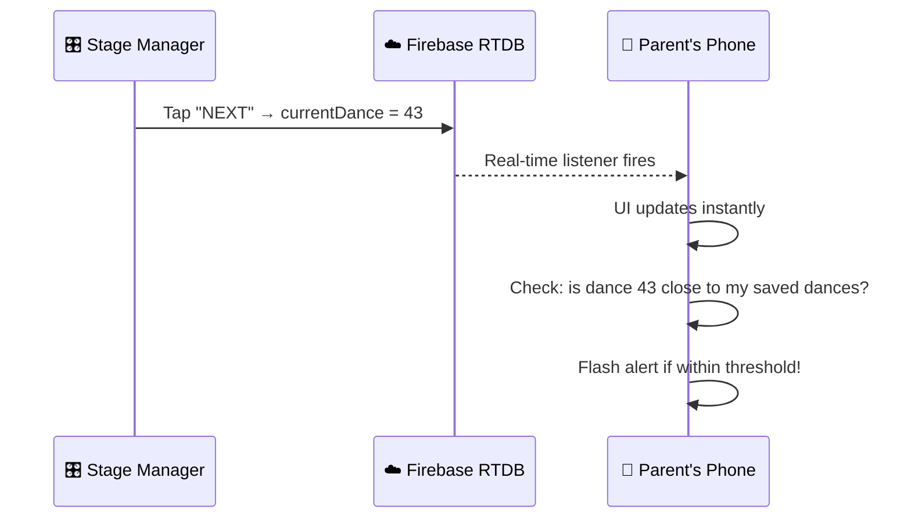

# Dance Competition Live Tracker — "DanceTrack"

A real-time web app that solves the #1 pain point at dance competitions: **parents missing their child's performance because the schedule is always off.**

---

## The Problem

- 600+ dances across 4 days at a competition
- Parents scroll through a huge PDF to find their child's dance number
- **Times listed in the PDF become meaningless** because the event runs ahead or behind
- The only way to know what's currently on stage is to be watching the stage
- Parents are in the lobby, getting food, backstage helping, etc. — they need a heads-up

## The Solution: Two-Screen App

A lightweight **real-time web app** with two interfaces:

### 🎛️ Stage Manager View (Admin)
A single person (stage manager, DJ, or volunteer) operates this on a tablet/phone backstage. Their job is dead simple:

- **One big "NEXT" button** — tap it when the next dance takes the stage
- Ability to jump to any dance number if needed
- Shows the current dance info for confirmation
- That's it. No complexity. It has to be foolproof under pressure.

### 📱 Parent View (Public)
Parents open a link on their phone (no app download needed). They:

1. **Enter their child's dance number(s)** — they can track multiple dances
2. See a **live dashboard** showing:
   - 🟢 **"NOW ON STAGE"** — current dance number & name
   - 📊 **"Your dances"** — a list of their saved dances with live countdowns:
     - `✅ Already performed`
     - `🔴 ON STAGE NOW!`
     - `🟡 UP NEXT (1 dance away!)`
     - `🟠 3 dances away`
     - `⬜ 47 dances away`
   - A color-coded timeline so they can glance and know at a glance
3. **Push-style alerts** — the page flashes/vibrates/plays a sound when their child is ~5 dances away and again at ~2 dances away (configurable)

> [!IMPORTANT]
> No login required for parents. They just open a link and enter dance numbers. Frictionless.

---

## Architecture

### Tech Stack
| Layer | Choice | Why |
|-------|--------|-----|
| Frontend | **Vanilla HTML/CSS/JS** | No build step, instant load, works on any phone |
| Backend / Real-time sync | **Firebase Realtime Database** | You already have Firebase set up. Real-time listeners mean parents see updates instantly without polling or refreshing |
| Hosting | **Firebase Hosting** | Free, fast CDN, HTTPS out of the box, deploy in seconds |
| Data import | **PDF parser (client-side JS)** | Admin uploads the competition PDF once, we parse it into structured data |

### Data Model (Firebase RTDB)

```
competitions/
  {competitionId}/
    name: "Spring Spectacular 2026"
    currentDance: 42              ← the magic number, updated by admin
    status: "running"             ← running | paused | break | finished
    dances/
      1:
        number: 1
        name: "Tiny Tappers"
        studio: "Dance Academy"
        category: "Mini Solo Tap"
        day: 1
        scheduledTime: "8:00 AM"    ← from the PDF (for reference only)
      2:
        number: 2
        name: "Glitter & Grace"
        ...
      ...600 entries
```

Parent's tracked dances are stored **locally in the browser** (localStorage) — no account needed.

### Real-Time Flow



---

## Screens & UX Design

### Screen 1: Landing Page
- Big title: **"[Competition Name] Live Tracker"**
- Two buttons:
  - **"I'm a Parent"** → Parent View
  - **"Stage Manager"** → Admin login (simple PIN code)

### Screen 2: Parent View
- **Search/Add bar** at top — type a dance number, tap ➕ to track it
- **"NOW ON STAGE"** hero card — big, bold, always visible
- **"My Dances"** list — each dance shows:
  - Dance number & name
  - Studio name
  - Status badge (performed / on stage / X away)
  - Color gradient from green (done) → red (on stage) → gray (upcoming)
  - Swipe to remove
- **Alert settings** — toggle sound/vibrate, set "warn me X dances before"
- Sticky bottom bar with current dance number always visible

### Screen 3: Admin / Stage Manager View
- **Massive current dance display** (number + name + studio)
- **Giant "NEXT ➡️" button** (the whole bottom half of the screen)
- **"PREVIOUS ⬅️" button** (smaller, in case of mistake)
- Jump-to-number input field
- Day selector tabs (Day 1 / Day 2 / Day 3 / Day 4)
- Optional: Quick list of upcoming 3-5 dances for confirmation

### Screen 4: Initial Setup (Admin only, one-time)
- Upload the competition PDF **or** paste/upload a CSV
- Preview the parsed data in a table
- Confirm & publish to Firebase
- Set competition name, PIN code for admin access

---

## Key Features

| Feature | Priority | Notes |
|---------|----------|-------|
| Real-time "current dance" sync | 🔴 Must | Core feature — Firebase RTDB listener |
| Parent dance tracking (localStorage) | 🔴 Must | No login, instant |
| Admin NEXT button | 🔴 Must | Simple, large, one-tap |
| "X dances away" countdown | 🔴 Must | The killer feature |
| Visual/audio alert when close | 🔴 Must | Vibrate + sound + flash |
| PDF import & parsing | 🟡 Should | Can fall back to CSV/manual entry |
| Day selector | 🟡 Should | Filter by competition day |
| Admin PIN protection | 🟡 Should | Prevent accidental changes |
| Shareable link per competition | 🟡 Should | QR code generation |
| "Break" / "Awards" status | 🟢 Nice | Admin can signal non-dance events |
| Push notifications (Service Worker) | 🟢 Nice | For when phone is locked/in pocket |

---

## Proposed File Structure

```
revel/
├── index.html              ← Landing page
├── parent.html             ← Parent tracking view  
├── admin.html              ← Stage manager view
├── setup.html              ← Competition setup / PDF import
├── css/
│   └── styles.css          ← Design system & all styles
├── js/
│   ├── firebase-config.js  ← Firebase init & config
│   ├── parent.js           ← Parent view logic
│   ├── admin.js            ← Admin view logic  
│   ├── setup.js            ← PDF parsing & data upload
│   ├── alerts.js           ← Sound/vibration alert system
│   └── utils.js            ← Shared utilities
├── assets/
│   ├── sounds/
│   │   └── alert.mp3       ← Notification sound
│   └── images/             ← Logo, icons
├── firebase.json           ← Firebase hosting config
├── .firebaserc             ← Firebase project link
└── firestore.rules         ← Security rules
```

---

## Implementation Order

1. **Firebase Setup** — Initialize RTDB, hosting, security rules
2. **Data Model & Setup Page** — CSV/manual data entry (PDF parsing can come later)
3. **Admin View** — The NEXT button + current dance display
4. **Parent View** — Real-time listener, dance tracking, countdown
5. **Alert System** — Sound, vibration, visual flash
6. **Landing Page** — Polish, QR code, competition branding
7. **PDF Import** — Parse the competition PDF (stretch goal for v1)
8. **Polish & Deploy** — Design refinement, testing, deploy to Firebase Hosting

---

## Verification Plan

### Browser Testing
- Open Admin view in one browser tab, Parent view in another
- Tap "NEXT" on admin → verify parent view updates in real-time (< 1 second)
- Add multiple dance numbers on parent view → verify countdown accuracy
- Verify alerts fire at the correct threshold
- Test on mobile viewport sizes (375px width)

### Manual Testing (User)
- Deploy to Firebase Hosting
- Open on your actual phone to verify:
  - Touch targets are large enough
  - Alerts work (sound + vibrate)
  - Real-time sync works across devices on different networks
  - The app is usable while walking around a competition venue

---

## Questions for You

1. **Do you already have the competition PDF?** If so, I can look at the format and build the parser to match it exactly.
2. **Who will operate the "NEXT" button?** This determines if we need a PIN or something more robust.
3. **How many dance numbers does a typical parent track?** (1-3? Or could it be 10+?)
4. **Do you want the app branded for this specific competition**, or generic enough to reuse for future competitions?
5. **Is there a specific Firebase project you want to use**, or should I create a new one?
